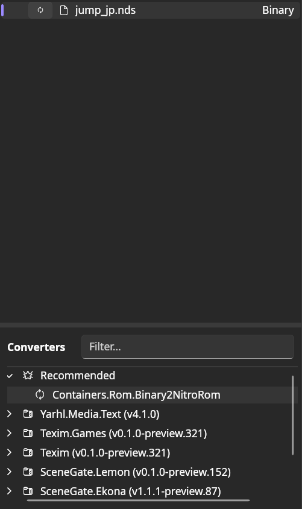
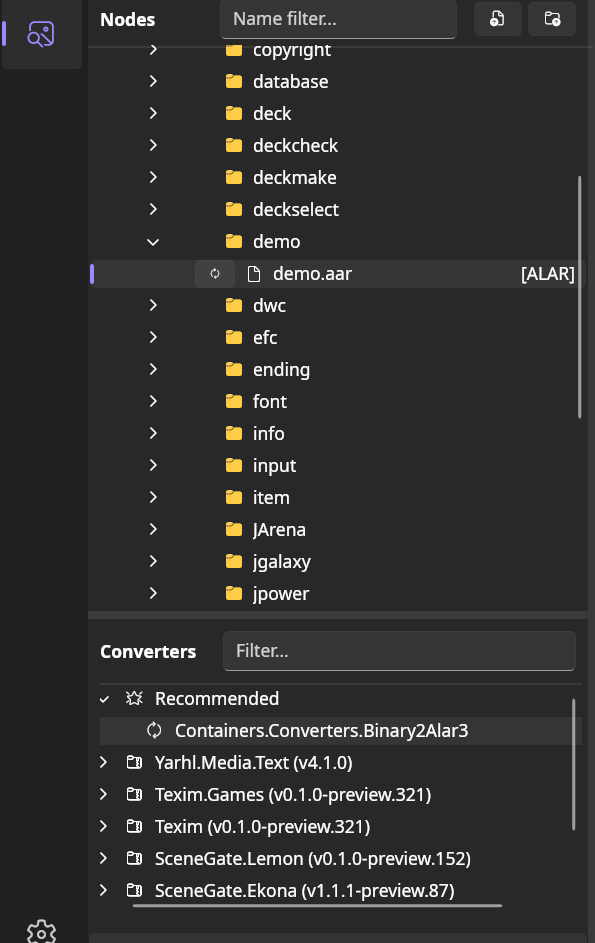
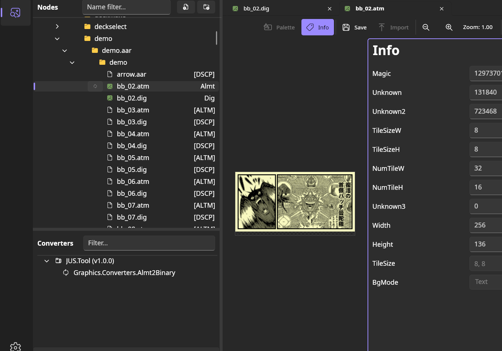

# JUSToolkit: SceneGate plugin

[SceneGate](https://code.pleonex.dev/SceneGate/SceneGate) is a UI tool for reverse
engineering analysis. You can import your custom Yarhl converters to analyze your
own games.

In this guide we'll see how to import the JUSToolkit converters.

## How to

1. Download the [latest SceneGate release](https://code.pleonex.dev/SceneGate/SceneGate/releases).

2. Compile this tool (JUSToolkit) and copy `src/JUS.Tool/bin/Debug/net10.0/JUS.Tool.dll`, 
   to the downloaded `SceneGate` folder, with the rest of .dll.

3. Run `SceneGate.Destktop`, open your legal dump of the game, select it, and 
double click in the Suggested Converter `Binary2NitroRom`. 

1. You can now navigate through the game files, and convert them using the Suggested 
Converters. You can display by double clicking after the conversion.
For _.dig + .atm_ convert both, and double click on the _.atm_.

